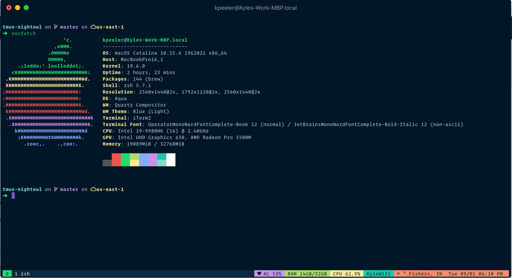

# Night Owl for [tmux](https://github.com/tmux/tmux/wiki)

> A dark theme for [tmux](https://github.com/tmux/tmux/wiki) using the beautiful [Night Owl colorscheme originally created by @sdras](https://github.com/sdras/night-owl-vscode-theme)

## Screenshot



## Install

Install using tpm
If you are a tpm user, you can install the theme and keep up to date by adding the following to your .tmux.conf file:

```shell
set -g @plugin 'kylepeeler/tmux-nightowl'
```

## Activating theme

1. Make sure run -b '~/.tmux/plugins/tpm/tpm' is at the bottom of your .tmux.conf
2. Run tmux
3. Use the tpm install command: prefix + I (default prefix is ctrl+b)

## Configuration

Customize the status bar by adding any of these lines to your .tmux.conf as desired:

Disable battery functionality:

```shell
set -g @nightowl-show-battery false
```

Disable network functionality:

```shell
set -g @nightowl-show-network false
```

Disable weather functionality:

```shell
set -g @nightowl-show-weather false
```

Switch from default fahrenheit to celsius:

```shell
set -g @nightowl-show-fahrenheit false
```

Enable powerline symbols:

```shell
set -g @nightowl-show-powerline true
```

Switch left powerline symbol (can set any symbol you like as seperator):

```shell
set -g @nightowl-show-left-sep n8
```

Switch right powerline symbol (can set any symbol you like as seperator):

```shell
set -g @nightowl-show-right-sep n
```

Enable military time:

```shell
set -g @nightowl-military-time true
```

Disable timezone:

```shell
set -g @nightowl-show-timezone false
```

Switch the left smiley icon (it can accept session, smiley, window, or any character.)

```shell
set -g @nightowl-show-left-icon session
```

Enable high contrast pane border:

```shell
set -g @nightowl-border-contrast true
```

Enable cpu usage:

```shell
set -g @nightowl-cpu-usage true
```

Enable ram usage:

```shell
set -g @nightowl-ram-usage true
```

Enable gpu usage:

```shell
set -g @nightowl-gpu-usage true
```

## Features

* Support for powerline
* Day, date, time, timezone
* Current location based on network with temperature and forecast icon (if available)
* Network connection status and SSID
* Battery percentage and AC power connection status
* CPU usage
* RAM usage
* GPU usage
* Color code based on if prefix is active or not
* List of windows with current window highlighted
* When prefix is enabled smiley face turns from green to yellow
* When charging, 'AC' is displayed
* If forecast information is available, a ☀, ☁, ☂, or ❄ unicode character corresponding with the forecast is displayed alongside the temperature

## Compatibility

Compatible with macOS and Linux. Tested on tmux 3.0a

## Contributors

This theme is maintained by the following person: [Kyle Peeler](https://github.com/kylepeeler)

[](https://github.com/kylepeeler) |
--- |
[Kyle Peeler](https://kylepeeler.codes) |

## License

[MIT License](./LICENSE)
